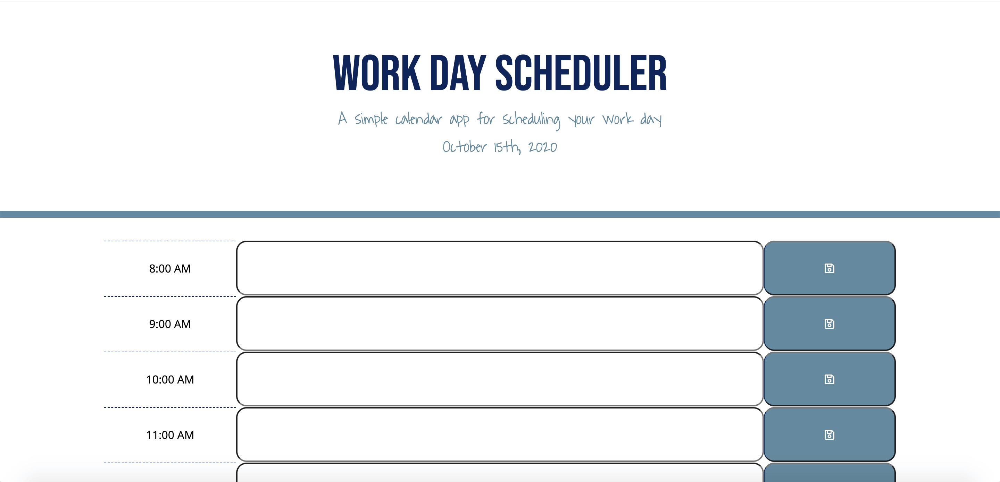

# 05_Third_Party_API's
For this project, we had to create a script that would allow someone to put their schedule in for the work day and save the input to local storage. As time passed, the color blocks are to change based on past, present, future.

# Still Struggling With...
I have had trouble getting the time blocks to change color. I know what I need to do, but am struggling to piece it all together. 

# Screenshot

